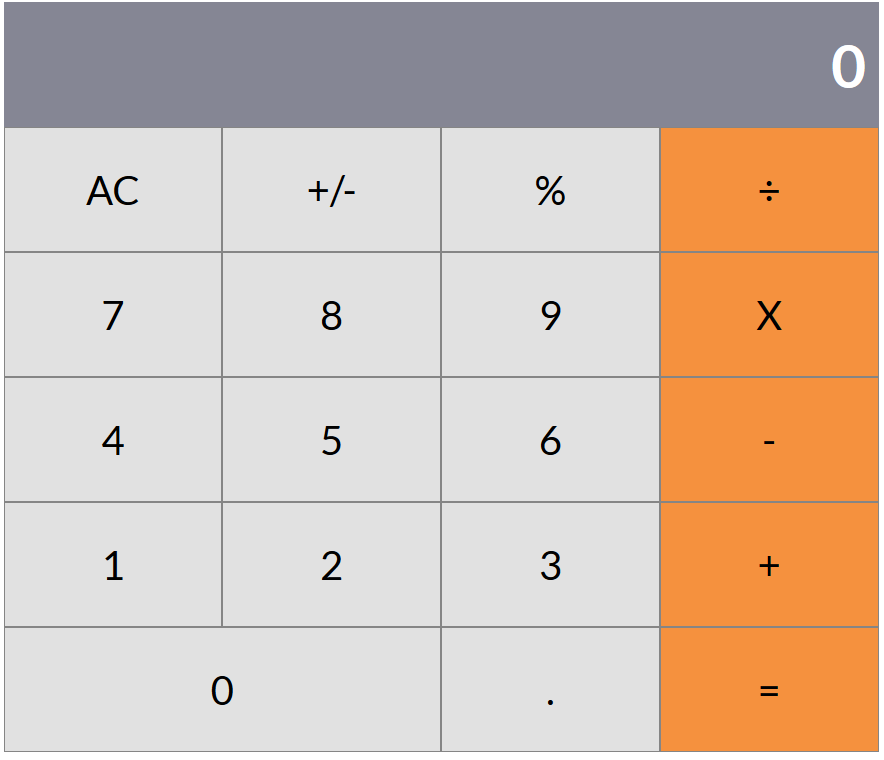

## Table of Contents

* [About the Project](#about-the-project)
* [Live version](#live-version)
* [Built With](#built-with)
* [Getting Started](#getting-started)
* [License](#license)
* [Contact](#contact)
* [Acknowledgements](#acknowledgements)

<!-- about-the-project -->
# About the project

Calculator is a Microverse project using REACT. The objective of the project is to understand how to build REACT applications using the ES6 syntax. The calculator works as expected and includes awesome features, for instance:

- You can't type more than two decimal points in one number (eg. 123.4 is allowed, whereas 123.4. or 123.. is not allowed. You can type 12.5+10.8).

- You can not change signs or take the percentage if you typed an operator (eg. You can not change signs of 124+).

- You can not type more than two operators in the same expression (eg. 1+2+ is not allowed).

To complete all these features, the use of Regular expressions is a must.

Enjoy!

## Live version

> [Here](https://calculator-lucas.herokuapp.com/)

## Built with

- Node v14.0.0
- npm v6.13.7
- React v16.13.1
- Jest

## Getting started

To get a local copy up and running follow these simple steps.

Clone or fork the [repository](https://github.com/lucasmazo32/calculator).

### `npm start`

Runs the app in the development mode. 
Open [http://localhost:3000](http://localhost:3000) to view it in the browser.

The page will reload if you make edits. 
You will also see any lint errors in the console.

### `npm test`

Launches the test runner in the interactive watch mode. 
See the section about [running tests](https://facebook.github.io/create-react-app/docs/running-tests) for more information.

### `npm run build`

Builds the app for production to the `build` folder. 
It correctly bundles React in production mode and optimizes the build for the best performance.

# License

> MIT

# Contact

Lucas Mazo:

- Twitter: [@lucasmazo32](https://twitter.com/lucasmazo32)
- Github: [lucasmazo32](https://github.com/lucasmazo32)
- LinkedIn: [Lucas Mazo](https://www.linkedin.com/in/lucasmazo/)
